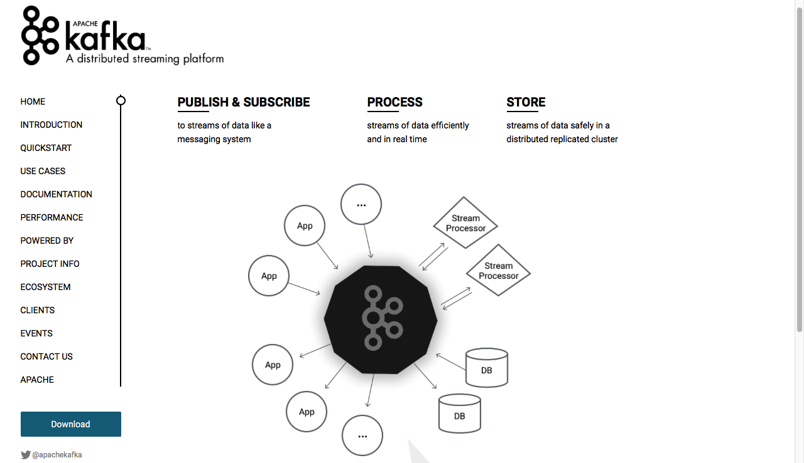

一、kafka的分布式部署
1.下载并分发kafka  
1.1官方网站
```
http://kafka.apache.org
```
 
1.2下载页面
```
http://kafka.apache.org/downloads
```
 
1.3下载命令：
```
wget http://mirrors.cnnic.cn/apache/kafka/0.10.1.0/kafka_2.11-0.10.1.0.tgz
```
1.4解压命令：
```
tar -xvf kafka_2.11-0.10.1.0.tar
```
1.5分发kafka   
```
scp -r /bigdata/software/kafka_2.11-0.10.1.0  qingcheng12:/bigdata/software/
scp -r /bigdata/software/kafka_2.11-0.10.1.0  qingcheng13:/bigdata/software/
```
  
2.配置并分发环境变量
```
1.编辑环境变量文件
执行命令：
    vim ~/.bashrc
编辑内容：
    在环境办理文件中加入如下内容
    export KAFKA_HOME=/bigdata/software/kafka_2.11-0.10.1.0
    export PATH=$KAFKA_HOME/bin:$PATH
2.分发环境变量文件到其他机器
执行命令：
    scp ~/.bashrc  qingcheng12:~/.bashrc
    scp ~/.bashrc  qingcheng13:~/.bashrc
3.在每个机器上刷新环境变量
执行命令：
    source   ~/.bashrc
4.测试环境环境变量是否配置成功 
执行命令：
    $KAFKA_HOME
执行效果：
    出现如下字样说明配置成功
   -bash: /bigdata/software/kafka_2.11-0.10.1.0: Is a directory
```
3.部署配置文件  
3.1配置server.properties文件  
配置命令：
```
 vim ${KAFKA_HOME}/config/server.properties
```
配置内容：
```
broker.id=11
num.partitions=3
log.dirs=${KAFKA_HOME}/data
zookeeper.connect=qingcheng11:2181,qingcheng12:2181,qingcheng13:2181
```

3.2分发并修正server.properties文件  
分发命令
```
scp -r ${KAFKA_HOME}/config/server.properties qingcheng12:${KAFKA_HOME}/config/server.properties
scp -r ${KAFKA_HOME}/config/server.properties qingcheng13:${KAFKA_HOME}/config/server.properties
```
修正命令：
```
vim ${KAFKA_HOME}/config/server.properties
```

修正内容:
```
broker.id=对应机器的id
```


4.启动服务  
4.1启动kafak服务  
在各个kafka节点上执行命令：
```
${KAFKA_HOME}/bin/kafka-server-start.sh ${KAFKA_HOME}/config/server.properties  > /dev/null 2>&1 &
```
4.2验证kafka服务  
在各个kafka节点上执行命令：
```
jps
```
能看到kafka进程。  


5.使用服务
创建主题：
```
${KAFKA_HOME}/bin/kafka-topics.sh \
--create \
--topic food \
--partitions 3 \
--replication-factor 2 \
--zookeeper qingcheng11:2181,qingcheng12:2181,qingcheng13:2181
```
 
列出主题：
```
${KAFKA_HOME}/bin/kafka-topics.sh \
--list \
--zookeeper qingcheng11:2181,qingcheng12:2181,qingcheng13:2181
```
 

描述主题：
```
${KAFKA_HOME}/bin/kafka-topics.sh \
--describe \
--topic food \
--zookeeper qingcheng11:2181,qingcheng12:2181,qingcheng13:2181
```
 


收发消息:
```
1.发送消息
${KAFKA_HOME}/bin/kafka-console-producer.sh \
--topic food \
--broker-list qingcheng11:9092,qingcheng12:9092,qingcheng13:9092 

2.接受消息
${KAFKA_HOME}/bin/kafka-console-consumer.sh \
--topic food \
--from-beginning \
--zookeeper qingcheng11:2181,qingcheng12:2181,qingcheng13:2181 
```
 
可见，kafka已经实现了消息的收发。至此，kafka的分布式部署算是成功了！

