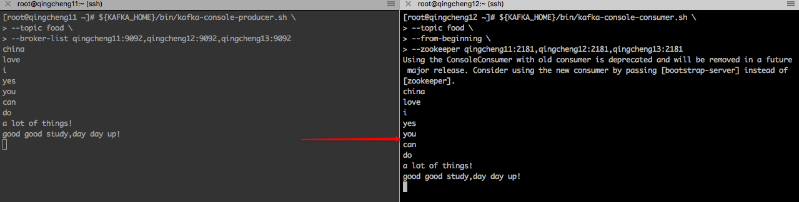
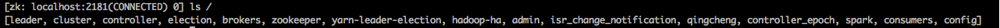
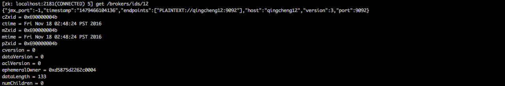
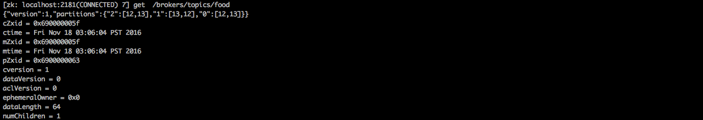

##一、kafka的分布式部署
###1.下载并分发kafka  
####1.1官方网站
```
http://kafka.apache.org
```
####1.2下载页面
```
http://kafka.apache.org/downloads
```
####1.3下载命令：
```
wget http://mirrors.cnnic.cn/apache/kafka/0.10.1.0/kafka_2.11-0.10.1.0.tgz
```
####1.4解压命令：
```
tar -xvf kafka_2.11-0.10.1.0.tar
```
####1.5分发命令 
```
scp -r /bigdata/software/kafka_2.11-0.10.1.0  qingcheng12:/bigdata/software/
scp -r /bigdata/software/kafka_2.11-0.10.1.0  qingcheng13:/bigdata/software/
```
  
###2.配置并分发环境变量
```
1.编辑环境变量文件
执行命令：
    vim ~/.bashrc
编辑内容：
    在环境办理文件中加入如下内容
    export KAFKA_HOME=/bigdata/software/kafka_2.11-0.10.1.0
    export PATH=$KAFKA_HOME/bin:$PATH
2.分发环境变量文件到其他机器
执行命令：
    scp ~/.bashrc  qingcheng12:~/.bashrc
    scp ~/.bashrc  qingcheng13:~/.bashrc
3.在每个机器上刷新环境变量
执行命令：
    source   ~/.bashrc
4.测试环境环境变量是否配置成功 
执行命令：
    $KAFKA_HOME
执行效果：
    出现如下字样说明配置成功
   -bash: /bigdata/software/kafka_2.11-0.10.1.0: Is a directory
```
###3.部署配置文件  
####3.1配置server.properties文件  
配置命令：
```
 vim ${KAFKA_HOME}/config/server.properties
```
配置内容：
```
必须配置：
    broker.id=11
    num.partitions=3
    log.dirs=${KAFKA_HOME}/data
    zookeeper.connect=qingcheng11:2181,qingcheng12:2181,qingcheng13:2181

可选配置：
    #在log.retention.hours=168 下面新增下面三项
    message.max.byte=5242880
    default.replication.factor=2
    replica.fetch.max.bytes=5242880
```
配置项说明：
```
#当前机器在集群中的唯一标识，和zookeeper的myid性质一样
broker.id=0 

#当前kafka对外提供服务的端口默认是9092
port=9092

#这个参数默认是关闭的，在0.8.1有个bug，DNS解析问题，失败率的问题。
host.name=192.168.7.100

#这个是borker进行网络处理的线程数
num.network.threads=3

#这个是borker进行I/O处理的线程数
num.io.threads=8 

#消息存放的目录，这个目录可以配置为“，”逗号分割的表达式，上面的num.io.threads要大于这个目录的个数这个目录，
#如果配置多个目录，新创建的topic他把消息持久化的地方是，当前以逗号分割的目录中，那个分区数最少就放那一个
log.dirs=/opt/kafka/kafkalogs/

#发送缓冲区buffer大小，数据不是一下子就发送的，先回存储到缓冲区了到达一定的大小后在发送，能提高性能
socket.send.buffer.bytes=102400

#kafka接收缓冲区大小，当数据到达一定大小后在序列化到磁盘
socket.receive.buffer.bytes=102400 

#这个参数是向kafka请求消息或者向kafka发送消息的请请求的最大数，这个值不能超过java的堆栈大小
socket.request.max.bytes=104857600 

#默认的分区数，一个topic默认1个分区数
num.partitions=1

#默认消息的最大持久化时间，168小时，7天
log.retention.hours=168

#消息保存的最大值5M
message.max.byte=5242880  

#kafka保存消息的副本数，如果一个副本失效了，另一个还可以继续提供服务
default.replication.factor=2 

#取消息的最大直接数
replica.fetch.max.bytes=5242880 

#这个参数是：因为kafka的消息是以追加的形式落地到文件，当超过这个值的时候，kafka会新起一个文件
log.segment.bytes=1073741824 

#每隔300000毫秒去检查上面配置的log失效时间（log.retention.hours=168）到目录查看是否有过期的消息如果有删除
log.retention.check.interval.ms=300000 

#是否启用log压缩，一般不用启用，启用的话可以提高性能
log.cleaner.enable=false 

#设置zookeeper的连接端口
zookeeper.connect=localhost:1218 
```

####3.2分发并修正server.properties文件  
分发命令
```
scp -r ${KAFKA_HOME}/config/server.properties qingcheng12:${KAFKA_HOME}/config/server.properties
scp -r ${KAFKA_HOME}/config/server.properties qingcheng13:${KAFKA_HOME}/config/server.properties
```
修正命令：
```
vim ${KAFKA_HOME}/config/server.properties
```

修正内容:
```
broker.id=对应机器的id
```


###4.启动服务  
####4.1启动kafka服务  

```
${KAFKA_HOME}/bin/kafka-server-start.sh ${KAFKA_HOME}/config/server.properties  > /dev/null 2>&1 &
```

>注意：  
>1.此命令需在各个kafka节点上执行  
>2.在启动kafka前要先启动zookeeper集群  


####4.2验证kafka服务  
在各个kafka节点上执行命令：
```
jps
```
能看到kafka进程。    

###5.使用服务    
####创建主题：
```
${KAFKA_HOME}/bin/kafka-topics.sh \
--create \
--topic food \
--partitions 3 \
--replication-factor 2 \
--zookeeper qingcheng11:2181,qingcheng12:2181,qingcheng13:2181
```
 
####列出主题：
```
${KAFKA_HOME}/bin/kafka-topics.sh \
--list \
--zookeeper qingcheng11:2181,qingcheng12:2181,qingcheng13:2181
```
 

####描述主题：
```
${KAFKA_HOME}/bin/kafka-topics.sh \
--describe \
--topic food \
--zookeeper qingcheng11:2181,qingcheng12:2181,qingcheng13:2181
```
 

####收发消息:
```
1.发送消息
${KAFKA_HOME}/bin/kafka-console-producer.sh \
--topic food \
--broker-list qingcheng11:9092,qingcheng12:9092,qingcheng13:9092 

2.接受消息
${KAFKA_HOME}/bin/kafka-console-consumer.sh \
--topic food \
--from-beginning \
--zookeeper qingcheng11:2181,qingcheng12:2181,qingcheng13:2181 
```
 
可见，kafka已经实现了消息的收发。至此，kafka的分布式部署算是成功了！

###6.kafka常用命令
```
1.启动服务
${KAFKA_HOME}/bin/kafka-server-start.sh ${KAFKA_HOME}/config/server.properties  > /dev/null 2>&1 

2.停止服务
停止：${KAFKA_HOME}/bin/kafka-server-stop.sh 
```

###7.日志说明  
默认kafka的日志是保存在${KAFKA_HOME}/logs目录下的，这里说几个需要注意的日志  
```
#kafka的运行日志
server.log

#kafka他是用zookeeper来保存状态，所以他可能会进行切换，切换的日志就保存在这里
state-change.log 

#kafka选择一个节点作为“controller”,当发现有节点down掉的时候它负责在游泳分区的所有节点中选择新的leader,
#这使得Kafka可以批量的高效的管理所有分区节点的主从关系。如果controller down掉了,活着的节点中的一个备份
#会切换为新的controller.
controller.log 
```

###8.zookeeper注册信息说明
####进入zookeeper的客户端
```
${ZOOKEEPER_HOME}/bin/zkCli.sh
```
####查看注册的znode：
```
 ls /
```
 
kafka生成7节点：[consumers, config, controller, isr_change_notification, admin, brokers, controller_epoch]  

####列出kafka节点
```
ls /brokers/ids
```
 

####查看kafka节点
```
get /brokers/ids/12
```
 

####列出kafka主题
```
ls  /brokers/topics
```
 

####查看kafka主题
```
get  /brokers/topics/food
```
 